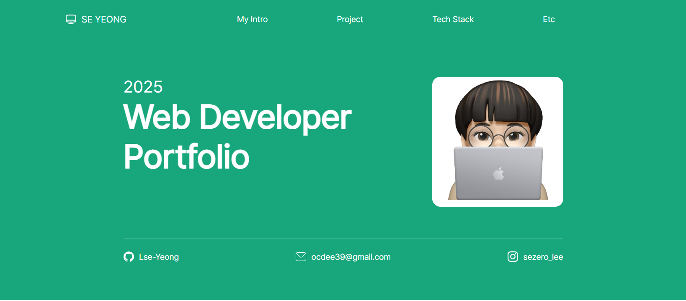
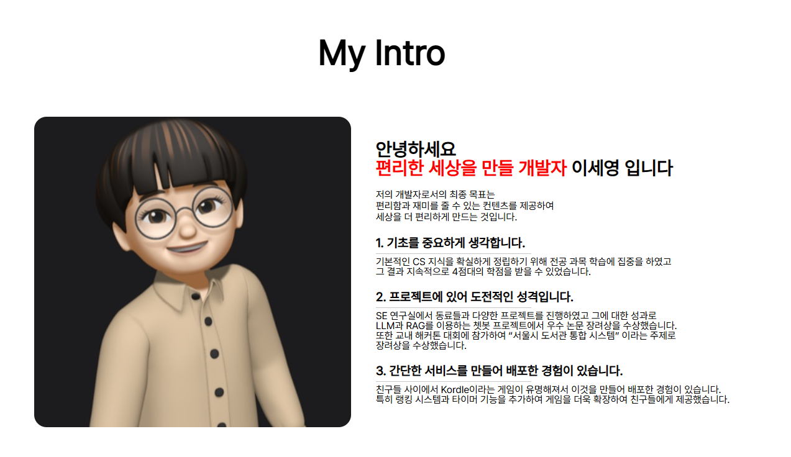
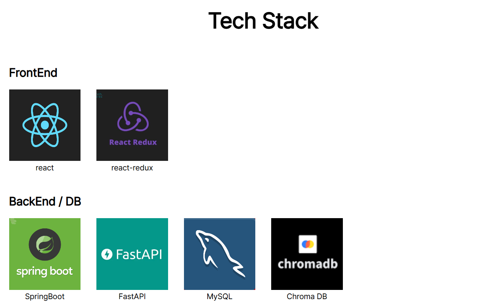
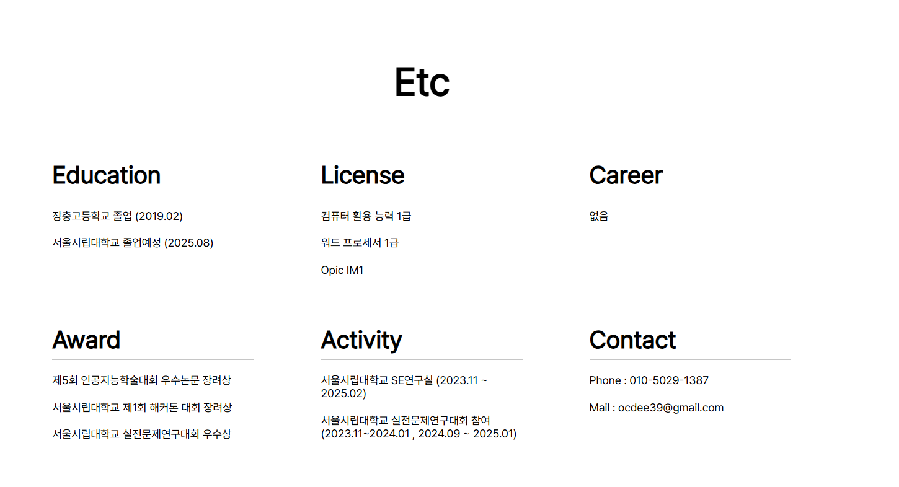

## 🔎 프로젝트 소개  

위 프로젝트는 개인 포트폴리오를 React를 이용하여 구현한 프로젝트 입니다.   
### 1. 프로젝트 기간
 **2024.12.31 ~ 2025.01.10**
### 2. 포함 내용
1. 화면 구성
2. 사용 기술 스택 
3. 디렉토리 구조 및 패키지 역할
4. 기술적 이슈 및 해결 과정
5. 프로젝트 팀원 및 역할

배포된 포트폴리오 웹 사이트는 다음 링크에서 확인할 수 있습니다.   
[포트폴리오 바로가기 🎓](https://portfolio-git-main-leeseyeongs-projects.vercel.app/)   

## 💻 화면 구성
### 기본 세팅
주조색(#18A77C)을 정하고, Grid Layout에 맞게 다음 설정값으로 구현했습니다. 
- Containor : 1320px
- Margin : 20px
- Gutter : 40px
### 1. Header 화면 
</img>   

### 2. 개인 소개 화면
</img>

### 3. 프로젝트 소개 화면
</img>

### 4. 기술 스택 화면
</img>

### 5. 기타 화면
</img>

## 🔧 사용 기술 스택

### Front-End


### Design UI / UX


### Tools


## 📂 디렉토리 구조 및 패키지 역할
```
src
 ┣ asset
 ┃ ┣ component
 ┃ ┣ fonts
 ┃ ┗ image
 ┣ page
 ┃ ┣ mainpage
 ┃ ┗ projectpage
 ┣ App.css
 ┣ App.js
 ┣ App.test.js
 ┣ index.css
 ┣ index.js
 ┣ logo.svg
 ┣ reportWebVitals.js
 ┗ setupTests.js
 ```
 -  asset : 프로젝트에 사용되는 image, component, fonts등 정적 파일을 관리
 - page : 각 페이지를 구현한 패키지
    - mainpage : 메인 페이지를 구현한 js 및 css 파일들의 모음
    - projectpage : 프로젝트 상세 페이지를 구현한 js 및 css 파일들의 모음

## ✅ 기술적 이슈 및 해결 과정
1. .pdf와 같은 파일들은 어떻게 보여주는지?
    - Recat 프로젝트에서 📂public/files 에 담아서 js에서 접근함
    - public 디렉토리는 빌드될 떄 루트 디렉토리 이므로 /{파일이름.확장자} 로 접근할 수 있음   
      
2. 새로운 내역이 생긴다면 어떻게 추가할지?
    - 비슷한 모양의 div 태그를 템플릿으로 만들어 텍스트 배열을 넘겨주면 display 할 수 있도록 만듬
    - 배열에 텍스트만 추가하면 간단하게 새로운 내역 추가 가능  

3. 프로젝트별로 페이지를 새로 만들어야 하나?
    - url을 "project/{id}"로 관리하여 하나의 템플릿 안에서 id에 따라 다른 프로젝트를 보여줄 수 있도록 구현
    - 없는 id로 접근을 하게 되면 프로젝트 정보가 존재하지 않는다고 사용자에게 알려준다.   

## 👬 프로젝트 팀원 및 역할
1. 🐶이세영 [LSe-Yeong](https://github.com/LSe-Yeong) -> **Ui/Ux** , **Front-End** 
